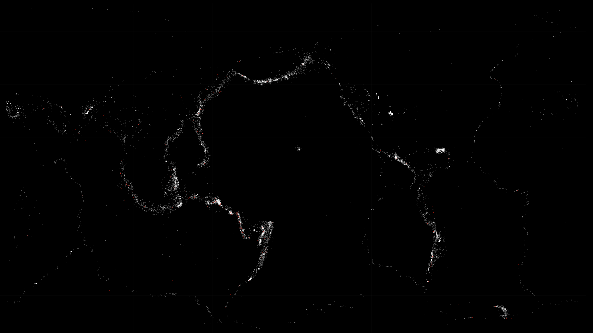

# EQmap
EQmap generates aesthetic figures using CSV Data from the [USGS Earthquake Catalog](https://earthquake.usgs.gov/earthquakes/search/)

# Example

Create a figure using the 3 example data files in /data/

    julia> using EQmap, Plots

    julia> gr(size=(1920, 1080))
    Plots.GRBackend()

    julia> gen_map(Pkg.dir("EQmap")*"/data/eq_3-5.csv", :white, 20000, scatter, 0.5, 0.2)

    julia> gen_map(Pkg.dir("EQmap")*"/data/eq_5-7.csv", :white, 2000, scatter!, 0.5, 0.2)

    julia> gen_map(Pkg.dir("EQmap")*"/data/eq_7-9.csv", :red, 200, scatter!, 1, 0.5)
  

